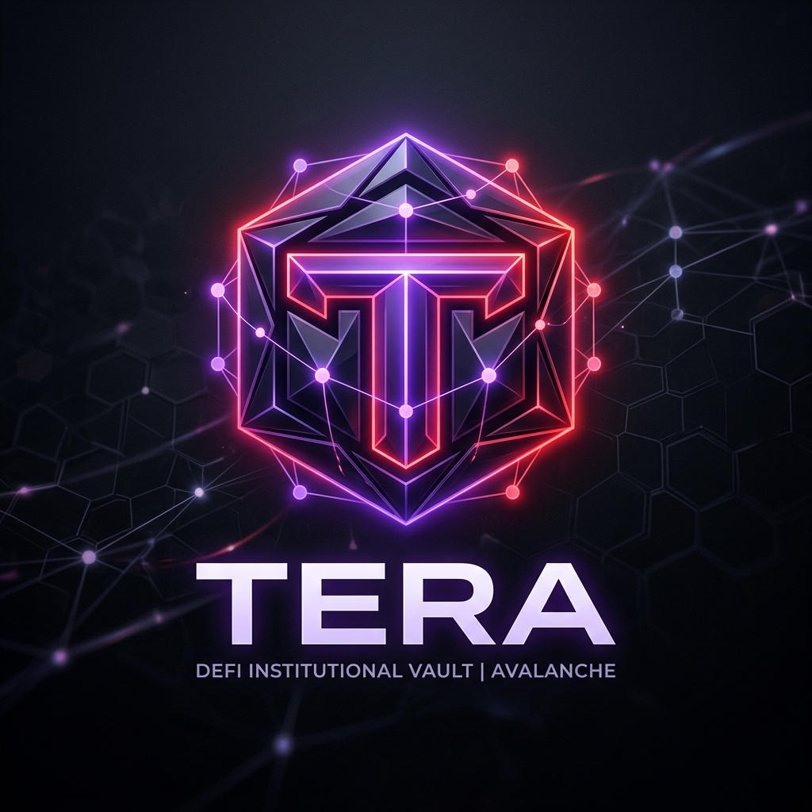
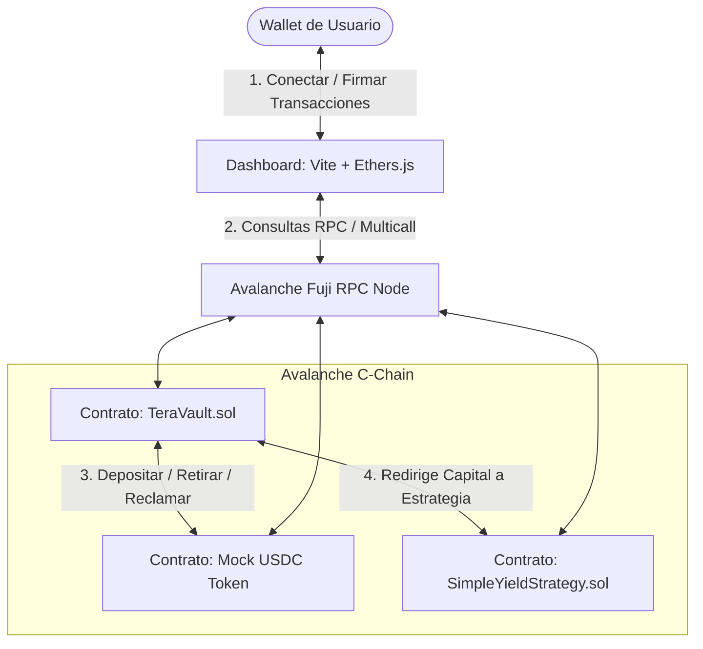

<div align="center">
  
  
  # 🔺 Tera Protocol — Yield Institucional en Avalanche

  [](https://subnets.avax.network/)
  [](https://soliditylang.org/)
  [](https://vitejs.dev/)
  [](https://tera-puce-seven.vercel.app)
  
  <p align="center">
    <strong>Plataforma DeFi descentralizada de grado institucional para la optimización de tesorería y maximización de rendimiento mediante bóvedas de tiempo bloqueado (Time-Lock Vaults) en la red de Avalanche.</strong>
  </p>

  ### 🌐 [¡Accede al Dashboard en Vivo!](https://tera-puce-seven.vercel.app)
</div>

---

## ⚡ ¿Qué es Tera?

**Tera** es una solución Web3 sin custodia (*non-custodial*) diseñada para empresas e inversores institucionales que buscan rentabilizar su capital de manera segura y transparente. 

Al aprovechar la infraestructura ultrarrápida y de bajísimas comisiones de **Avalanche C-Chain**, Tera ofrece una experiencia de inversión fluida y robusta. Los usuarios pueden depositar activos estables (como **USDC**) en contratos inteligentes auditables, configurando sus propios periodos de bloqueo para obtener tasas de APY progresivas y predecibles.

---

## 🎨 Características Clave

*   **🔒 Bóvedas con Bloqueo Personalizado (`TeraVault.sol`):** Los depósitos están sujetos a un temporizador individualizado por usuario (desde 60 segundos para pruebas locales hasta 1 año para maximizar retornos).
*   **📈 Modelo de Rendimiento Lineal Integrado:** El APY escala de manera inteligente de acuerdo a la duración del bloqueo seleccionada:
    *   `< 1 Hora` ➔ **2% APY**
    *   `< 1 Día` ➔ **4% APY**
    *   `< 7 Días` ➔ **6% APY**
    *   `< 30 Días` ➔ **8% APY**
    *   `>= 30 Días` ➔ **12% APY**
*   **💸 Reclamación de Rendimiento en Tiempo Real (`claimYield`):** Los usuarios pueden extraer de forma autónoma únicamente el rendimiento devengado acumulado linealmente sin necesidad de liquidar o tocar su capital principal.
*   **🛡️ Arquitectura Extensible y Segura:**
    *   Uso estricto de las librerías `SafeERC20`, `ReentrancyGuard` y `Pausable` de **OpenZeppelin**.
    *   Diseño modular con una estrategia de rendimiento acoplable (`SimpleYieldStrategy.sol`) actualizable por gobernanza.
    *   Fondeado con reservas de rendimiento iniciales (1,000 USDC) para garantizar la liquidez inmediata de las pruebas.
*   **📊 Dashboard Institucional High-End:** Interfaz premium con estados dinámicos, gráficos de rendimiento a 30 días, feed en tiempo real de transacciones y diagnóstico activo de conexión RPC de la red Avalanche.

---

## 🏗️ Diagrama de Arquitectura

El siguiente flujo ilustra cómo interactúa la aplicación web con los Smart Contracts en la red Avalanche Fuji:



---

## 🚀 Guía de Inicio Rápido (Local)

Sigue estos pasos para compilar, probar y desplegar el entorno local de Tera en tu computadora.

### 📋 Prerrequisitos
Asegúrate de tener instalados:
*   [Node.js](https://nodejs.org/) (Versión 18 o superior recomendada)
*   [Git](https://git-scm.com/)
*   Una wallet Web3 (como MetaMask o Rabby) configurada con la red Avalanche Fuji Testnet.

### 1. Clonar e Instalar Dependencias
```bash
git clone <url-del-repositorio>
cd tera
npm install
```

### 2. Configurar Variables de Entorno
Copia el archivo de plantilla `.env.example` como `.env`:
```bash
cp .env.example .env
```
Abre `.env` y agrega la clave privada de tu wallet de pruebas:
```env
PRIVATE_KEY=tu_clave_privada_aqui
```

### 3. Compilar los Contratos Inteligentes
Compila la arquitectura de contratos utilizando Hardhat:
```bash
npm run compile
```

### 4. Ejecutar las Pruebas Unitarias
Tera cuenta con una suite completa de pruebas unitarias que cubren los flujos de depósitos, bloqueos temporales, cobro de comisiones y límites administrativos:
```bash
npm run test
```

### 5. Desplegar en Red Local o Testnet
*   **Despliegue Local (Hardhat Network):**
    ```bash
    npm run deploy:local
    ```
*   **Despliegue en Avalanche Fuji Testnet (Recomendado):**
    ```bash
    npm run deploy:fuji
    ```

Una vez ejecutado en Fuji, la consola imprimirá las direcciones de los contratos recién desplegados, las cuales puedes verificar en [Snowtrace](https://testnet.snowtrace.io/).

### 6. Iniciar el Frontend Web
Levanta el servidor de desarrollo local con Vite:
```bash
npm run dev
```
Abre tu navegador en `http://localhost:5173` y conecta tu billetera.

---

## 📍 Contratos Desplegados en Avalanche Fuji

Puedes interactuar con los contratos oficiales de Tera en la red de pruebas a través de las siguientes direcciones verificadas:

| Contrato | Dirección en Fuji Testnet | Explorador (Snowtrace) |
| :--- | :--- | :--- |
| **TeraVault** | `0x410b59511F07954463844b1B6cd7E78342F10ae9` | [Ver en Snowtrace](https://testnet.snowtrace.io/address/0x410b59511F07954463844b1B6cd7E78342F10ae9) |
| **Mock USDC** | `0xfE07D751408281d7825B4E66d1EeCC59B32493c5` | [Ver en Snowtrace](https://testnet.snowtrace.io/address/0xfE07D751408281d7825B4E66d1EeCC59B32493c5) |

---

## 🤝 Soporte y Prueba Guiada

¿Deseas experimentar la plataforma y necesitas tokens de prueba (Fuji AVAX / USDC) u orientación paso a paso? **¡Estamos listos para guiarte!**

📧 Escríbenos directamente a: **[jchocobar886@gmail.com](mailto:jchocobar886@gmail.com)**

Te proporcionaremos:
1.  Fondos de prueba gratuitos en Avalanche Fuji (AVAX de prueba y Mock USDC).
2.  Un recorrido interactivo guiado por Zoom/Google Meet de todas las funcionalidades del dashboard.
3.  Asistencia técnica para conectar y configurar tu wallet Web3.

---

<div align="center">
  <p>Desarrollado con ❤️ y 🔺 para la comunidad de Avalanche.</p>
  <strong>Tera Protocol © 2026 — Finanzas Descentralizadas del Siguiente Nivel</strong>
</div>
